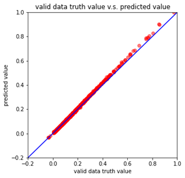
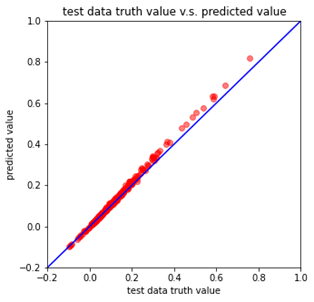
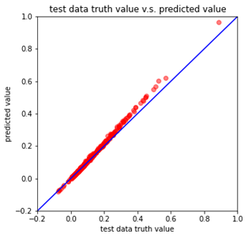
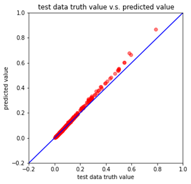
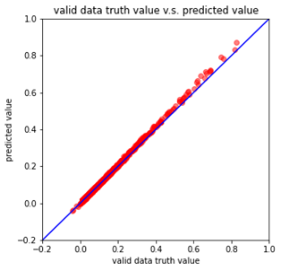
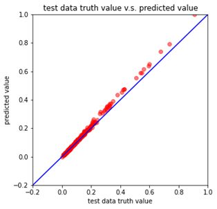

## Summary
Solve cell corner characterization problem through regression with deep neural networks(DNN).

***Input Features:***
* voltage
* temperature
* process
* cell_rise (1:True/0:False)
* rise_transition (1:True/0:False)
* cell_fall (1:True/0:False)
* fall_transition (1:True/0:False)
* output_load 
* input_slope

***Label:***
* timing_value

## Model Structure
```
self.layers = nn.Sequential(
            nn.Linear(input_dim, 256),
            nn.ReLU(),
            nn.Linear(256,64),
            nn.ReLU(),
            nn.Linear(64,16),
            nn.ReLU(),
            nn.Linear(16,8),
            nn.ReLU(),
            nn.Linear(8,4),
            nn.ReLU(),
            nn.Linear(4,1)
        )
```

## Hyper Parameters
```
config = {
    'seed': 96524,       
    'select_all': True,   # whether to use all features.
    'valid_ratio': 0.2,   # validation_size = train_size * valid_ratio
    'test_ratio': 0.05,   # test_size = train_size * test_ratio
    'n_epochs': 3000,     # number of epochs.            
    'batch_size': 64, 
    'learning_rate': 0.0005,              
    'early_stop': 400,    # if model has not improved for this many consecutive epochs, stop training.     
    'save_path': './models/model.ckpt'  
}
``` 

## Experimental Results: Predict Value v.s. True Value

> *$\mathnormal{precision} = 1 - \mathnormal{error}$*\
> *$\mathnormal{error} = \frac{\mathnormal{predict value} - \mathnormal{true value}}{\mathnormal{true value}}$*


***Valid Data***
| cell | NAND2X1_RVT  | NOR2X1_RVT  | AND2X1_RVT  |  OR2X1_RVT |
|---|---|---|---|---|
| mean precision  |  96.74% |  96.44% | 92.78%  | 93.17% |
| mean error  |  3.26% | 3.56%  | 7.22%  | 6.83%   |
|   |   |   |   |   |

***Test Data***
| cell | NAND2X1_RVT  | NOR2X1_RVT  | AND2X1_RVT  |  OR2X1_RVT |
|---|---|---|---|---|
| mean precision | 93.30%  | 92.89%  |  92.07% | 86.35%  |
| mean error  | 6.70%  | 7.11%  |  7.93%  | 13.65%  |
|   |   |   |   |   |

## References:
* https://github.com/ga642381/ML2021-Spring/blob/main/HW01/HW01.ipynb
* https://github.com/Beer-and-Skittles/Cell-Library-json2csv-Converter/blob/main/README.md